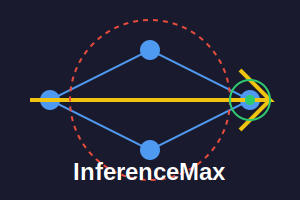

# inferencemax



inferencemax is a flexible library for text generation using the max engine. It provides a streamlined workflow for loading, exporting, and running inference on various model architectures.

## Project Structure

```
inferencemax/
├── data/
│   ├── __init__.py
│   ├── export.py
│   ├── hf.py
│   ├── load.py
│   └── onnx.py
├── utils/
│   ├── __init__.py
│   ├── decorators.py
│   └── logger.py
├── __init__.py
├── generator.py
├── initializer.py
├── kv_cache.py
├── sampler.py
├── text_generation.py
└── tokenizer.py
```

## Key Features

- Support for loading models from HuggingFace and ONNX formats
- Efficient model export to ONNX format
- Customizable text generation pipeline
- KV-cache support for improved inference speed
- Flexible sampling strategies (temperature, top-k)
- Comprehensive logging and timing decorators

## Usage

Here's a basic example of how to use InferenceMax:

```python
from inferencemax.data.load import load_model, load_tokenizer
from inferencemax.text_generation import generate_text

# Load model and tokenizer
model_path = "path/to/your/model"
model = load_model(model_path)
tokenizer = load_tokenizer(model_path)

# Generate text
input_text = "Once upon a time"
generated_text = generate_text(model, tokenizer, input_text)

print(generated_text)
```

## CLI Usage

InferenceMax also provides a command-line interface for easy text generation:

```bash
python cli.py --model_path "path/to/your/model" --input_text "Once upon a time" --max_new_tokens 50
```

## Configuration

You can customize the generation parameters using a YAML configuration file:

```yaml
max_new_tokens: 50
temperature: 0.8
top_k: 40
```

Then use it with the CLI:

```bash
python cli.py --model_path "path/to/your/model" --input_text "Once upon a time" --config_path "path/to/config.yaml"
```

## Contributing

Contributions are welcome! Please feel free to submit a Pull Request. This is not aim to replace vLLM or something else but rather a place to learn and test things.

## License

This project is licensed under the terms of the LICENSE file in the root directory.